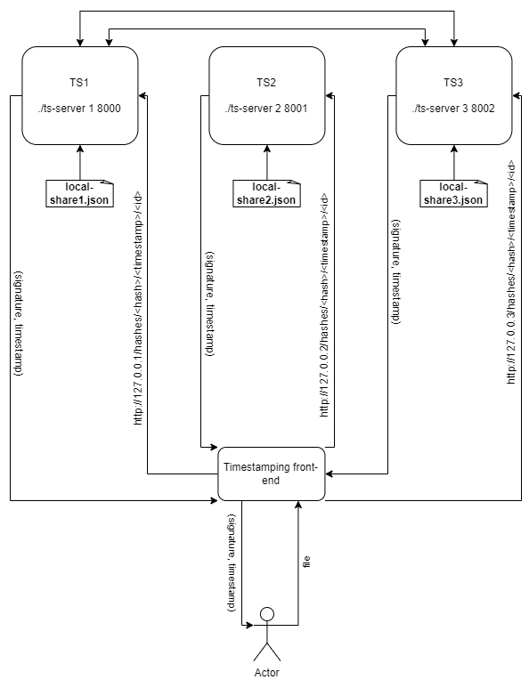
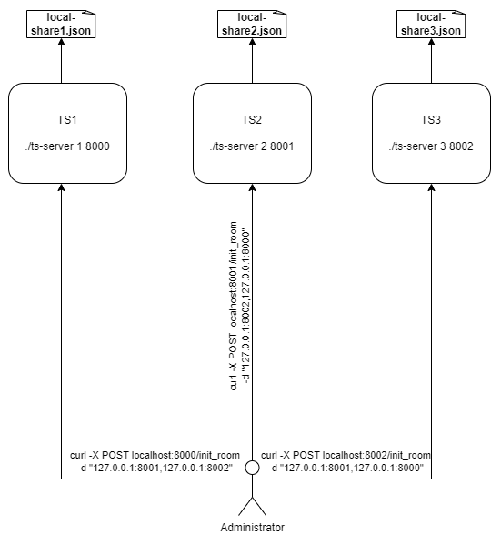

# Trusted timestamping server with threshold signing key

*By Adam Hlaváček (493110), Dávid Maslo (485351), David Rajnoha (492758); [project repository](https://github.com/davidmaslo/timestamping-server/)*

## 1 Selected technologies stack

- **Rust** as programming language -- thanks to its memory safe and concurrency-safe properties, we found it fitting for usage in scenario which performs cryptographic with possibly highly sensitive data
- **Multi-party ECDSA** by [ZenGo-X](https://github.com/ZenGo-X/multi-party-ecdsa/) is a library written in Rust under GPLv3 license with support for `t`-of-`n` signing treshold specification, so it was a natural choice
- **Plain HTML & JS & CSS3** for a single frontend webpage, which uses [Bootstrap](https://getbootstrap.com/docs/5.0/) to unify the look and feel on all browsers with effortless scaling for mobile devices together with few useful components like progress bar. To simplify the DOM operations in JavaScript a microframework [GRenderer](https://github.com/QRGameStudio/web-libs/tree/main/GRenderer) was used.
- To simplify communication between frontend and backend teams, **OpenAPI v3** schema was created. Furthermore, with this schema, the process of implementing client in another language is as effortless as using the [codegen](https://github.com/swagger-api/swagger-codegen) tool to generate all code required for communication

## 2 Overall project design

The project is divided into a frontend for client interaction and three identical backends for performing the MPC timestamping.

<i>Figure 1: A diagram of the project components with signing procees</i>

### 2.1 Backend

There exist exactly three independent backend servers running the same code, differentiated only by their parametrization during startup. Because all three server are identical copy of each another feature-wise and, after the initial private key shares are generated, only two of them are required to complete the operation, a single point of failure is eliminated. 

#### 2.1.1 Setup phase

During first setup, each server accepts two arguments:

1. its identification ($id \in \{1,2,3\}$) number which is unique for given server in the signing group
2. port on which to run

These arguments are then saved into a local file  (together with a generated key in a later phase) and are automatically loaded during subsequent runs of the server.

Next, the server expects the administrator to call an endpoint with addresses of the another two servers that are required for creating a communication channel and a shared key.

##### 2.1.1.1 Creating communication channel

Given that a communication channel needs to be established for both initial generation of a shared ECC key and for timestamping of the documents, this step needs to be performed in any case. The used multi-party ECDSA library provides an easy abstraction for to broadcast all IO operation messages, while leaving the implementation of underlining delivering of messages to all parties on the developer. For accepting inputs from other servers, each server has an exposed HTTP endpoints which feed the messages to the libraries interface. Then, every message received from the library is forwarded to the locally saved addresses of the other servers.

##### 2.1.1.2 Creating a shared key

During initial setup, after all of the servers have indicated, that they are able to connect to all other servers, a process of generating a shared key can begin. The generation is mostly handled by the underlining library over the created communication channel, the resulting local share of the MPC generated key is then stored into a local file.

<i>Figure 2: How key generation is requested</i>

#### 2.1.2 Creating a timestamp

Each server publishes an HTTP endpoint on which it expects a SHA256 hash of a file,  timestamp and index of another server that that is supposed to perform MPC timestamping together with this server. The timestamp needs to be in a time range for it to be considered valid. After the endpoint is called, the server then utilizes the provided library function to perform a signature where the signed message is the received hash. If the signing process succeeds, the signature together with the timestamp is then returned as a response to the original HTTP query.

## 3 Frontend

The frontend that is shipped with this projects is in a form of a web page. This web page uses only plain HTML, CSS3 and JavaScript with a few linked libraries, which allows for independent hosting of the page, unrelated to the hosting of backends. Inside the page are saved addresses of all three servers as constants, so the page can be opened as a file on a local computer and still function properly.

For convenience of the user, the webpage provides a reactive interactive form that allows selecting the file to be timestamped. After user confirms that they selected the correct file, a SHA256 hash of the file is computed locally in the browser to protect the confidentiality of the file. The frontend then iteratively tries to connect to the saved servers and perform the timestaping by calling respective endpoint. If the server does not respond in time or returns an invalid response, the client tries to contact next server. If no of the servers is able to finalize the timestamping process, the frontend signalizes an error. The whole process can is trackend on shown progress bar with information text about currently performed operation.

After successful stamping, the file with timestamp is presented to the user for download.

Even though the client is written as a web page, it is easy for other developers to create their custom client in a language of their choosing as the communication schema between the frontend and backend is specified in an OpenAPI v3 format.

## 4 Current progress

In its current status, the server is able to estabilish a two-way communication link with other servers and also perform key generation independently. The webpage interface of the web-page is almost complete, function-wise the page is able to mock the signing operation by choosing if the signing process was successful or not by random.

### 4.1 Subjects for change

There are various subjects that are performing suboptimally in the current prototype status, namely:

- privacy protection - all communication between servers is done on plain HTTP. This can be improved by putting the servers behind a reverse HTTP proxy with HTTPS enabled.
- servers authentication - currently anyone can call internal endpoints of the servers. This does not pose a great security risk as no private information is ever shared, but still could lead to a DOS attack if a malicious attacker decided to pose as two valid servers and prevented them to join. A possible solution is to create a shared token that will be required to be supplied by a server when calling another server's internal endpoint.
- hash calculation on the frontend - to calculate the SHA256 of a file the webpage currently uses a standard function that needs first to read whole file into memory. This makes timestaping large files impractical. A possible solution is to use a third-party library that can create a hash of a large file by reading it in chunks.
